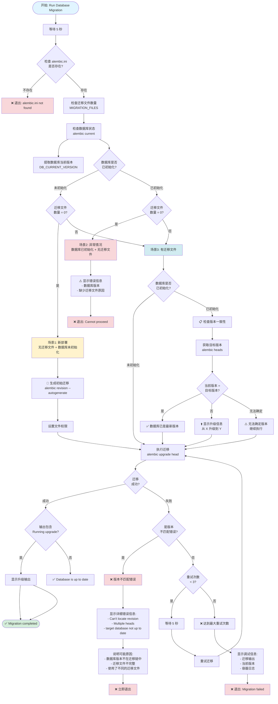

# 数据库迁移流程图

## Run Database Migration 完整流程

## 场景说明

### 场景1: 新部署
- **条件**: 无迁移文件 + 数据库未初始化
- **操作**: 自动生成初始迁移
- **结果**: 创建第一个迁移文件并应用到数据库

### 场景2: 异常情况
- **条件**: 数据库已初始化 + 无迁移文件
- **操作**: 报错退出
- **原因**: 迁移文件未从代码仓库部署

### 场景3: 正常迁移
- **条件**: 有迁移文件
- **子场景**:
  - **3.1**: 数据库未初始化 → 直接执行迁移
  - **3.2**: 数据库已初始化 → 检查版本一致性后执行迁移
    - 版本相同 → 跳过（已是最新）
    - 版本不同 → 执行升级
    - 版本不匹配 → 报错退出

## 错误处理

### 版本不匹配错误
检测以下 Alembic 错误：
- `Can't locate revision` - 数据库版本不在迁移链中
- `Multiple heads` - 迁移文件有多个头
- `target database is not up to date` - 其他版本问题

### 重试机制
- 最多重试 3 次
- 每次失败后等待 5 秒
- 第 3 次失败后显示详细调试信息并退出

